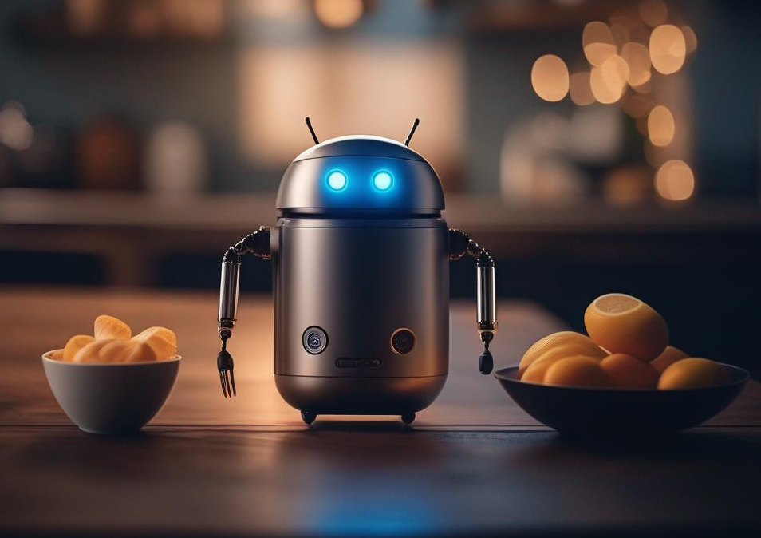

# NutriBot: a nutritionist assistant

This repository contains all the code needed to launch a demo of a nutritionist assistant chatbot called **NutriBot**.
It can answer all your questions, and will provide personalized advices based on what you tell him. You can also upload food or beverage images, and it will automatically recognize what are on those images.  

**NutriBot** is based on [zephyr](https://arxiv.org/abs/2310.16944) for the conversation, and has access to [idefics](https://arxiv.org/abs/2306.16527) to process images.

⛔️ **Limitations:** This chatbot is not an authorized medical tool, and should not be used as such. Its responses should not be considered as medical advice. If you have a specific medical condition, it is always best to consult with a qualified healthcare professional for personalized advice. Moreover, **NutriBot** was not reinforced for
safety further than model it is based on, so it can be jailbreaked 
relatively easily. In those scenarios, it can provide harmful answers.
